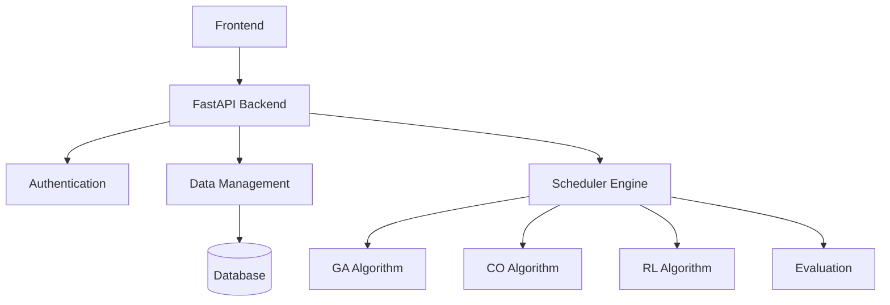
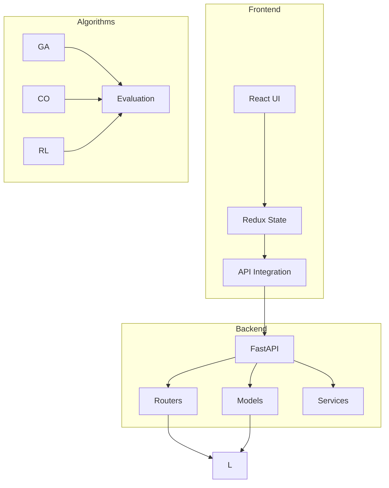
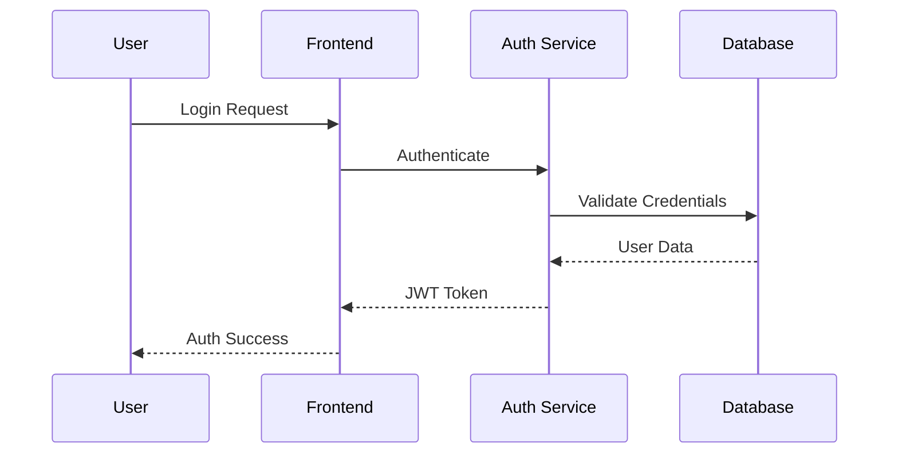
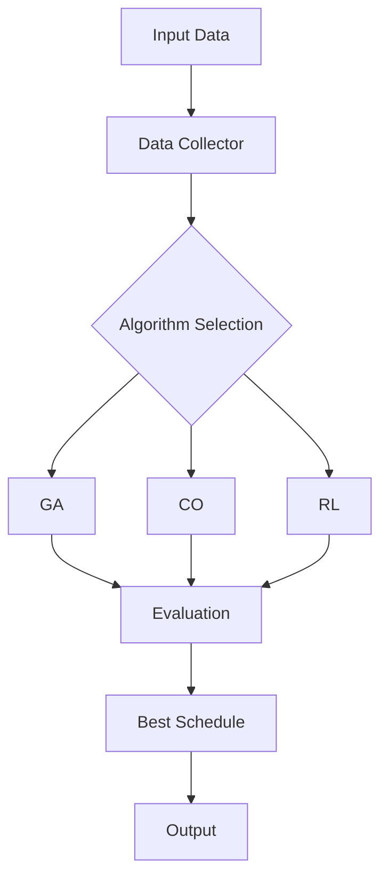

# University Scheduler Backend

Project 24-25J-238


## Project Description
The University Scheduler Backend is an advanced timetable scheduling system that uses multiple AI algorithms to generate optimal schedules for universities. The system employs Genetic Algorithms (GA), Constraint Optimization (CO), Reinforcement Learning (RL), and comprehensive evaluation metrics to create conflict-free timetables while considering various constraints.

## 👥 Team  Members

### Group Leader: IT21259852 - Weerasinghe K.D.E.I - it21259852@my.sliit.lk

### Member 1: IT21172182 - Wijayawardhana G.L.C.N.D. - it21172182@my.sliit.lk  

### Member 2: IT21208980 - De Silva K H P N - it21208980@my.sliit.lk    

### Member 3: IT21266164 - Udayantha D.M.S - it21266164@my.sliit.lk  

## System Architecture



## Component Architecture



### Authentication Flow 



## Setup Instructions

### Prerequisites
- Python 3.8+
- MongoDB
- Virtual Environment

### Installation Steps
```bash
# Clone the repository
git clone https://github.com/your-repo/university-scheduler-backend.git
cd university-scheduler-backend

# Create and activate virtual environment
python -m venv venv
source venv/bin/activate  # Linux/Mac
.\venv\Scripts\activate   # Windows

# Install dependencies
pip install -r requirements.txt

# Run the application
uvicorn main:app --reload
fastapi dev run
```
